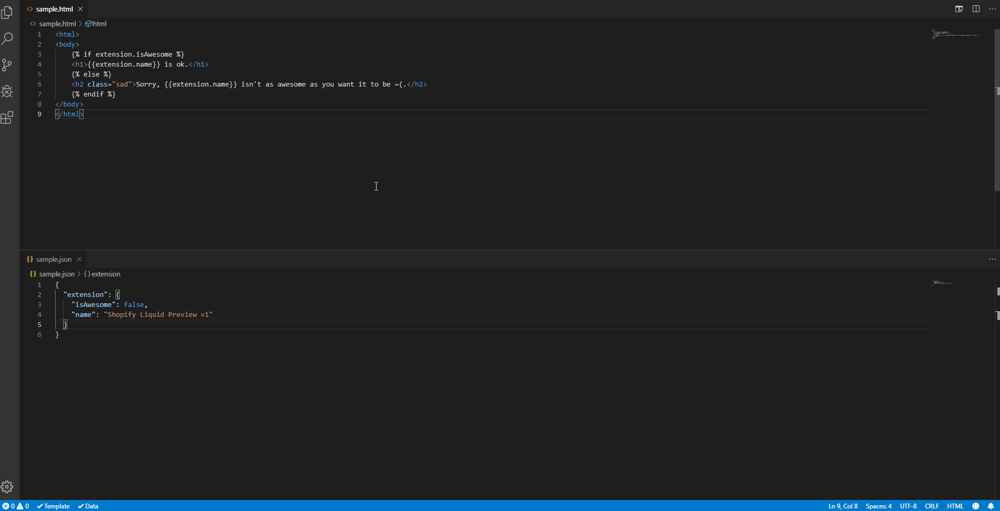

# Shopify Liquid Preview for Visual Studio Code

Gives a live preview for Shopify Liquid templates. The extension can compile multiple Shopify Liquid templates on the fly, applying preview data and rendering the result in separate window.

## Features

- Live preview for Shopify Liquid templates, updating as you type.
- Support for fake data. Choose your json file to be a context of the template, your preview will also update as you type.
- Able to preview multiple templates using the same or different fake data.

## Usage

- Use the keybinding `ctrl+shift+p` and type **Shopify Liquid: Open Preview to the Side** to run from command panel or use the keybinding `ctrl+k v` while selecting a file with a `.liquid` extension.
- Choose the file to use as fake data from the file explorer.

## Demo

## Credits

- [Handlebars Preview for Visual Studio Code](https://github.com/chaliy/vscode-handlebars-preview/)
- [A HTML previewer for Visual Studio Code](https://marketplace.visualstudio.com/items?itemName=tht13.html-preview-vscode)

## License

MIT